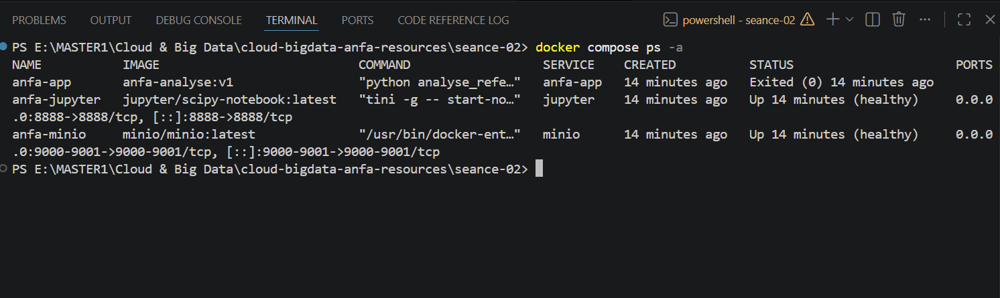
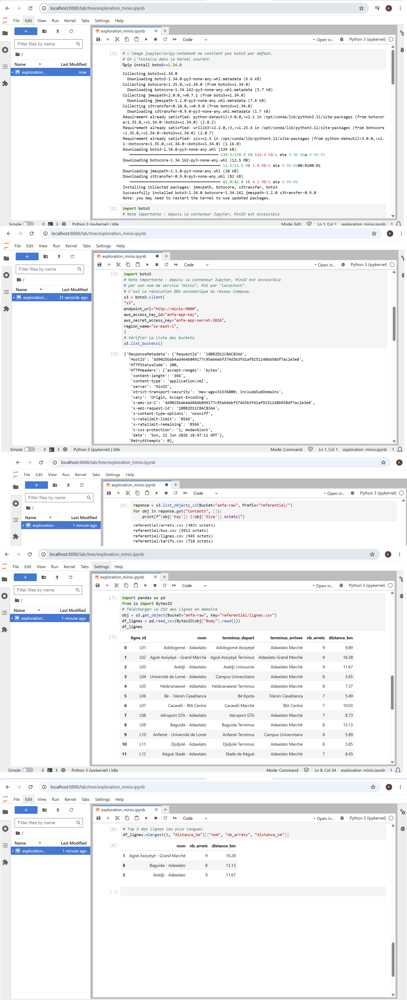

# Rendu - Séance 2

**Nom et prénom :** YEYE Koffi Gagnon
**Identifiant GitHub :** felixcule
**Date de soumission :** 26/06/2026

## Résumé de la séance

Cette séance explore la conteneurisation Docker : elle couvre l'écriture d'un Dockerfile pour décrire la construction d'une image, le build et l'exécution de cette image en conteneur, puis l'orchestration d'un stack à 3 services via Docker Compose (application, base de données, stockage). En pratique, un notebook Jupyter conteneurisé lit et écrit des données dans MinIO (stockage objet S3-compatible), démontrant le flux complet du code à la production.

## Étapes principales

1. Écriture du Dockerfile et construction de l'image `anfa-analyse:v1` (taille observée : XX Go).
2. Mise en place du `.dockerignore` et observation du cache de Docker.
3. Écriture du `docker-compose.yml` orchestrant MinIO, Jupyter, et l'image custom.
4. Création du notebook `exploration_minio.ipynb` qui lit les données depuis MinIO via boto3 et pandas.

## Captures d'écran

### docker compose ps

### Notebook Jupyter

## Bonus multi-stage (optionnel)

Taille image v1            : 1.17GB  
Taille image v2-multistage :  446MB  
Gain en pourcentage        :    61.88034% soit 62%  

## Réponses aux exercices d'application

EXERCICE 1 : QCM Conceptuel  
1.1 C  
Un conteneur partage le noyau de la machine hôte.
Le cours précise qu'un conteneur n'est pas une VM. Il s'agit de processus Linux isolés par namespaces qui partagent le noyau Linux unique de la machine hôte. La VM (option A) embarque son propre OS, pas le conteneur. La conteneurisation démarre en millisecondes, pas la VM (option B fausse). Les deux technologies ne s'opposent pas mais se complètent.  
1.2 B   
L'image est un modèle figé en lecture seule ; le conteneur est une instance en cours d'exécution.
Le cours définit l'image comme « un modèle figé, contenant un système de fichiers et des métadonnées », analogue à une classe en POO. Le conteneur est « une instance en cours d'exécution d'une image, avec une couche d'écriture par-dessus », analogue à un objet instancié.  
1.3 B   
Les namespaces
Les namespaces sont « la technique qui donne à un processus l'illusion d'être seul au monde ». Linux propose 7 types : PID, NET, MNT, UTS, IPC, USER, CGROUP. Ce sont eux qui cloisonnent la vue des ressources pour un groupe de processus.  
1.4 A    
Les cgroups
Les cgroups (control groups) « sont la technique qui limite ce qu'un processus peut consommer ». Sans cgroups, un conteneur mal codé pourrait consommer toute la RAM ou tout le CPU de l'hôte. Ils limitent le CPU, la mémoire, l'I/O disque et le nombre de processus.  
1.5 B    
Dans une machine virtuelle Linux invisible gérée par Docker Desktop.
« macOS n'est pas Linux. Il n'a pas les namespaces, ni les cgroups ». Docker Desktop lance une VM Linux légère en arrière-plan via l'Apple Virtualization Framework. WSL2 (option C) est spécifique à Windows, pas macOS.  
1.6 B  
La société d'origine qui a créé et open-sourcé Docker en 2013.
« Mars 2013. Une startup en difficulté du nom de DotCloud […] décide d'open-sourcer son outil interne de conteneurisation. Cet outil s'appelle Docker ». DotCloud se rebaptisera Docker, Inc.  
1.7 C  
Docker a apporté un format d'image portable, une CLI simple et un registre public, en s'appuyant sur les mêmes primitives que LXC.
« Ce que Docker apporte techniquement : presque rien de nouveau. Docker utilise les mêmes primitives du noyau Linux que LXC ». Les 4 contributions décisives sont : CLI ultra-simple, format d'image portable, Docker Hub, API par-dessus la complexité du noyau. Docker a transformé la conteneurisation « d'un sujet de sysadmin en un sujet de développeur ».  
1.8 B  
Open Container Initiative — une norme ouverte pour les images et le runtime.
« 2015 : Open Container Initiative (OCI). Une norme ouverte pour les images et le runtime de conteneurs, fondée par Docker, CoreOS, Google, IBM, Microsoft, RedHat ». Une image conforme OCI peut tourner sur n'importe quel runtime conforme OCI.    

EXERCICE 2 : Lecture et analyse d'un Dockerfile

2.1 Explication des instructions

| Instruction                           | Rôle                                                                |
| ------------------------------------- | ------------------------------------------------------------------- |
| `FROM python:3.11`                    | Définit l'image de base (Python 3.11 complet, ~1 Go)                |
| `WORKDIR /application`                | Crée et définit le répertoire de travail dans le conteneur          |
| `COPY ./application`                  | Copie le code source de l'hôte vers l'image                         |
| `RUN pip install -r requirements.txt` | Installe les dépendances Python au moment du build                  |
| `EXPOSE 5000`                         | Documente le port 5000 (informatif, n'ouvre pas réellement le port) |
| `CMD ["python", "app.py"]`            | Commande par défaut exécutée au démarrage du conteneur              |

Différence EXPOSE 5000 vs -p 5000:5000 :
* EXPOSE 5000 est déclaratif : il documente quel port l'application utilise, visible via docker ps, mais ne rend pas le port accessible depuis l'extérieur.
* -p 5000:5000 dans docker run est opérationnel : il crée le mapping de port entre l'hôte (5000) et le conteneur (5000), rendant le service réellement accessible.

2.2 - Deux problèmes dans le Dockerfile original

| Problème                                              | Explication                                                                                                                                               | Correction                                                        |
| ----------------------------------------------------- | --------------------------------------------------------------------------------------------------------------------------------------------------------- | ----------------------------------------------------------------- |
| **Image de base trop lourde**                         | `python:3.11` fait ~1 Go. L'image complète est rarement nécessaire.                                                                                       | Utiliser `python:3.11-slim` (~150 Mo)                             |
| **Ordre des instructions non optimisé pour le cache** | `COPY ./application` avant `RUN pip install` invalide le cache dès qu'un fichier source change, forçant la réinstallation des dépendances à chaque build. | Copier `requirements.txt` d'abord, installer, puis copier le code |

2.3 - Dockerfile corrigé

#### Image de base allégée
FROM python:3.11-slim

#### Création d'un utilisateur non-root pour la sécurité
RUN useradd --create-home appuser
USER appuser

#### Dossier de travail
WORKDIR /app

#### Optimisation du cache : copier d'abord les dépendances
COPY requirements.txt .
RUN pip install --no-cache-dir -r requirements.txt

#### Puis copier le code source (change souvent, mais ne casse plus pip install)
COPY . .

#### Documentation du port
EXPOSE 5000

#### Commande de démarrage
CMD ["python", "app.py"]

EXERCICE 3 : Diagnostic

3.1 Le build qui échoue
a. Cause précise de l'erreur :
L'instruction RUN pip install -r requirements.txt s'exécute avant que le fichier requirements.txt ne soit copié dans l'image.
A ce stade du build, le fichier n'existe pas encore dans le contexte du conteneur.

b. Correction du Dockerfile :
FROM python:3.11-slim
WORKDIR /app
COPY requirements.txt .          # ← Copier D'ABORD le fichier de dépendances
RUN pip install --no-cache-dir -r requirements.txt  # ← PUIS l'installer
COPY . .                         # ← Enfin copier le reste du code
CMD ["python", "app.py"]

c. Mauvaise compréhension illustrée :
Cette erreur révèle une confusion entre le contexte de build (fichiers sur la machine hôte) et le système de fichiers de l'image (couches construites séquentiellement). Chaque instruction RUN s'exécute dans l'état de l'image à ce moment précis. Le cours insiste sur le fait que « l'ordre compte pour le cache » : les dépendances (qui changent peu) doivent être installées avant le code source (qui change souvent).

3.2 Le conteneur qui ne voit pas l'autre
a. Erreur dans le DATABASE_URL :
localhost fait référence à la boucle locale du conteneur api lui-même, pas à la machine hôte. Chaque conteneur a son propre localhost isolé par le namespace NET.

b. Correction :
DATABASE_URL: "postgresql://user:password@db:5432/anfa"

Dans Docker Compose, chaque service est automatiquement résolvable par son nom de service (db) sur le réseau Docker virtuel interne. Le cours précise : « Ils se voient par leur nom de service, pas par leur IP ».

EXERCICE 4 : Optimisation d'image
Quatre problèmes identifiés :

| # | Problème                       | Explication                                                                                                        |
| - | ------------------------------ | ------------------------------------------------------------------------------------------------------------------ |
| 1 | **Image de base inadéquate**   | `FROM` sans tag précis → instable. De plus, utiliser `python:3.11-slim` évite d'installer manuellement python3.    |
| 2 | **Cache apt non nettoyé**      | `apt-get update` et `apt-get install` en instructions séparées laissent les caches dans une couche intermédiaire.  |
| 3 | **Outils de build inutiles**   | `build-essential`, `git`, `wget` sont des outils de compilation lourds qui ne servent pas au runtime.              |
| 4 | **Pas d'utilisateur non-root** | Le conteneur s'exécute en root par défaut, violant le principe du moindre privilège.                               |
| 5 | **Pas de .dockerignore**       | Le `COPY . /app` embarque potentiellement `.git/`, `.venv/`, `__pycache__/` (page 57).                             |
| 6 | **Multi-stage build absent**   | L'image fait 1,1 Go car elle contient les outils de build. Un multi-stage build séparerait compilation et runtime. |

Dockerfile optimisé avec multi-stage build :

#### Étape 1 : Builder (image lourde avec outils de compilation)
FROM python:3.11 AS builder
WORKDIR /build
COPY requirements.txt .
RUN pip install --user --no-cache-dir -r requirements.txt

#### Étape 2 : Runtime (image finale légère)
FROM python:3.11-slim
WORKDIR /app

#### Création utilisateur non-root
RUN useradd --create-home appuser
USER appuser

#### Copie uniquement les dépendances installées
COPY --from=builder /root/.local /root/.local
COPY . .

ENV PATH=/root/.local/bin:$PATH
CMD ["python", "app.py"]

Gain : De 1,1 Go à ~200 Mo.

EXERCICE 5 : Mini-cas d'architecture
a. Services à conteneuriser
| Service      | Rôle                                                                                         |
| ------------ | -------------------------------------------------------------------------------------------- |
| **pipeline** | Script Python qui lit le FTP, nettoie les données GPS et écrit dans MinIO                    |
| **minio**    | Stockage objet S3-compatible pour persister les fichiers JSON Lines et les résultats agrégés |
| **jupyter**  | Notebook pour explorer les données dans MinIO et créer des graphiques                        |

b. Restart policy recommandée
* Je choisirai : on-failure
* Parce que le pipeline s'exécute une fois par nuit (batch), pas en continu. always redémarrerait le conteneur en boucle après succès, ce qui est inutile. on-failure ne redémarre que si le script échoue (erreur réseau FTP, timeout MinIO), permettant une reprise automatique sans boucle infinie. no empêcherait toute reprise. unless-stopped est proche mais redémarre aussi après un reboot Docker.

c. Passer la date au script - Deux mécanismes
| Mécanisme                         | Implémentation                                                   | Avantage                                   | Inconvénient                         |
| --------------------------------- | ---------------------------------------------------------------- | ------------------------------------------ | ------------------------------------ |
| **Variable d'environnement**      | `DATE_EXECUTION=2024-06-01 docker compose run pipeline`          | Simple, pas de modification du code Python | Moins explicite pour l'orchestration |
| **Argument en ligne de commande** | `docker compose run pipeline python script.py --date 2024-06-01` | Tracabilité directe dans les logs          | Nécessite de surcharger le CMD       |

d. Pour répondre à la question Pourquoi séparer le script du conteneur Jupyter; je dirai :
Le script de pipeline et le notebook Jupyter ont des responsabilités et des cycles de vie différents. Le pipeline est un job batch qui s'exécute une fois par nuit avec des dépendances spécifiques (client FTP, librairies de nettoyage). Jupyter est un service interactif longue durée avec des besoins différents (visualisation, kernels). Les mélanger violerait le principe de separation of concerns : une mise à jour du notebook ne devrait pas impacter le pipeline critique, et l'exploration interactive ne doit pas consommer les ressources du traitement nocturne.

e. Squelette du docker-compose.yml
version: "3.8"

services:
  minio:
    image: minio/minio:latest
    container_name: anfa-minio
    ports:
      - "9000:9000"
      - "9001:9001"
    volumes:
      - minio-data:/data
    environment:
      MINIO_ROOT_USER: minioadmin
      MINIO_ROOT_PASSWORD: minioadmin
    command: server /data --console-address ":9001"
    healthcheck:
      test: ["CMD", "curl", "-f", "http://localhost:9000/minio/health/live"]
      interval: 10s
      timeout: 5s
      retries: 3

  pipeline:
    build: ./pipeline
    container_name: anfa-pipeline
    environment:
      MINIO_ENDPOINT: http://minio:9000
      MINIO_ACCESS_KEY: minioadmin
      MINIO_SECRET_KEY: minioadmin
      FTP_HOST: ftp.anfa.bj
      DATE_EXECUTION: ${DATE_EXECUTION:-}
    depends_on:
      minio:
        condition: service_healthy
    restart: on-failure

  jupyter:
    build: ./jupyter
    container_name: anfa-jupyter
    ports:
      - "8888:8888"
    environment:
      MINIO_ENDPOINT: http://minio:9000
      MINIO_ACCESS_KEY: minioadmin
      MINIO_SECRET_KEY: minioadmin
    volumes:
      - ./notebooks:/home/jovyan/work
    depends_on:
      - minio

volumes:
  minio-data:

## Difficultés rencontrées

J'ai réalisé le multi-stage, mais la taille de l'image v1 et celle de l'image v2-multistage sont les mêmes (1.17 GB); par conséquent, je n'ai pas obtenu le gain attendu.