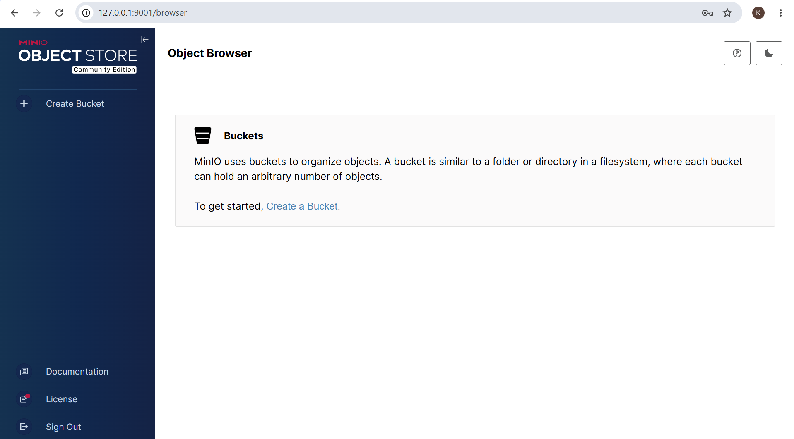
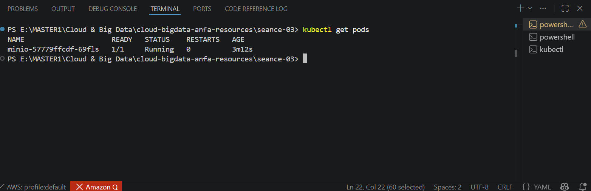
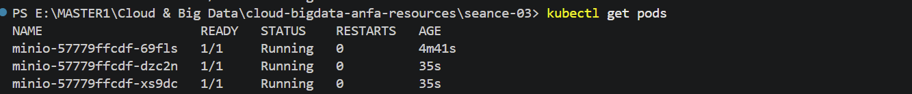

**Nom et prénom :** YEYE Koffi Gagnon  
**Identifiant GitHub :** felixcule  
**Date de soumission :** 26/06/2026  

## Résumé de la séance

Au cours de cette séance, Kind a été installé, un cluster Kubernetes a été créé et le namespace anfa a été configuré pour isoler les ressources du projet. MinIO a ensuite été déployé à l'aide de trois manifestes YAML (PVC, Deployment et Service). Les fonctionnalités de self-healing ont été observées en supprimant un Pod, tandis que le scaling a été testé en augmentant le nombre de réplicas. Enfin, un Ingress Controller a été activé afin de préparer l'exposition des services HTTP au sein du cluster. 

## Étapes principales

1. Installation de Kind et kubectl, création du cluster `anfa`.
2. Création du namespace `anfa` et configuration de kubectl.
3. Déploiement de MinIO via 3 manifestes YAML (PVC, Deployment, Service).
4. Observation du self-healing après suppression manuelle d'un pod.
5. Scaling du Deployment de 1 à 3 replicas, puis retour à 1.
6. Activation de l'Ingress Controller nginx.
## Captures d'écran

### Console MinIO accessible via port-forward

### Self-healing observé

### Scaling à 3 replicas

## Réponses aux exercices d'application

EXERCICE 1 : QCM Conceptuel  
1.1 B   
Kubernetes orchestre des conteneurs sur un cluster de machines, en s'appuyant sur un container runtime (containerd, Docker, CRI-O).  

1.2 B   
etcd est une base de données clé-valeur qui stocke l'état complet du cluster. L'API Server est le point d'entrée, le Scheduler décide du placement, le Controller Manager exécute les boucles de contrôle.  
1.3 C  
Scheduler décide sur quel Worker Node chaque nouveau pod doit être placé. Le kubelet est un composant Worker Node, pas du Control Plane.  
1.4 C  
À l'API Server, qui est le point d'entrée unique du cluster.
« API Server : point d'entrée unique du cluster. Toutes les commandes passent par lui ». kubectl ne parle jamais directement aux pods ou à etcd.  
1.5 B  
Le Deployment recrée immédiatement un nouveau pod pour respecter l'état souhaité.

1.6 B  
Les trois types de Services sont définis dans le cours: ClusterIP (interne uniquement), NodePort (exposé sur un port de chaque nœud, accessible sans load balancer cloud), LoadBalancer (provisionne un load balancer externe cloud). L'Ingress (D) est une couche au-dessus du Service, pas un type de Service. Le TP utilise NodePort avec Kind : « Type NodePort : expose le service sur un port de chaque nœud du cluster → permet l'accès depuis l'extérieur ».  
1.7 B    
Elle modifie l'état souhaité du Deployment à 5 replicas ; Kubernetes converge vers ce nombre.
 
1.8 B  
À isoler logiquement les ressources (séparation par équipe, environnement, ou application).
Le Namespace permet de cloisonner avec les cas d'usage d'un un namespace par équipe, par environnement, par application. Les ressources sont nommées dans leur namespace, avec quotas et politiques de sécurité par namespace.  
1.9 B  
Le nœud Kubernetes est un conteneur Docker. Kind a lancé un conteneur Docker basé sur l'image kindest/node.

EXERCICE 2 : Lecture et interprétation d'un manifeste  
2.1 - Rôle de selector.matchLabels et lien avec template.metadata.labels  
Le selector.matchLabels définit quelles pods ce Deployment doit gérer. Il sélectionne les pods ayant le label app: anfa-api. Le template.metadata.labels assigne ce même label aux pods créés par le Deployment. Le lien : le Deployment utilise le selector pour identifier « ses » pods — ceux qu'il doit surveiller, remplacer en cas de panne, ou scaler. Si les labels ne correspondent pas, le Deployment ne reconnaît pas les pods qu'il a créés.  
2.2 - Nombre de pods et self-healing    
2 pods seront créés (replicas: 2). Si l'un meurt, le Deployment remarque que l'état observé (1 pod) ne correspond pas à l'état souhaité (2 pods) et recrée immédiatement un nouveau pod pour revenir à 2 replicas.   
2.3 - Pourquoi minio et pas une adresse IP ?    
Parce que Kubernetes dispose d'un DNS interne de cluster qui résout les noms de service automatiquement. Dans Docker Compose, ils se voient par leur nom de service. En Kubernetes, c'est identique : les services se trouvent les uns les autres par leur nom . Le Service minio (déployé dans le même namespace) est enregistré dans le DNS interne du cluster. L'adresse IP d'un pod est éphémère (elle change à chaque recréation), alors que le nom de service est stable.     

2.4 - Conséquence de l'absence de Service  
Sans Service, l'API est inaccessible depuis l'extérieur du cluster et même difficilement accessible de manière stable depuis l'intérieur. Les pods ont des IPs éphémères qui changent à chaque redémarrage. Il n'y a pas de point d'entrée stable, pas de load balancing entre les 2 replicas, et pas de routage DNS interne. D'autres pods ne peuvent pas se connecter de manière fiable. 

2.5 - Manifeste de Service ClusterIP 
#### service-anfa-api.yaml
apiVersion: v1
kind: Service
metadata:
  name: anfa-api
  namespace: anfa
spec:
  type: ClusterIP        # accessible uniquement à l'intérieur du cluster
  selector:
    app: anfa-api        # cible les pods du Deployment
  ports:
    - port: 80           # port exposé par le service
      targetPort: 8000   # port du conteneur dans le pod
      protocol: TCP

EXERCICE 3 : Diagnostic  
3.1 - Le pod qui ne démarre pas (ImagePullBackOff)    
a. Que signifie le statut ImagePullBackOff ?  
C'est un statut d'erreur indiquant que Kubernetes n'arrive pas à télécharger (pull) l'image Docker depuis le registre. Le système réessaie avec un délai croissant (backoff exponentiel).  

b. Cause probable  
L'image minio/miniooo:latest contient une faute de frappe : miniooo au lieu de minio. L'image n'existe pas sur Docker Hub.

c. Commande pour obtenir plus de détails  
kubectl describe pod minio-7d9f8b6c5-x2k9p  
Cette commande affiche les événements du pod, y compris le message d'erreur exact du pull d'image. Alternative : kubectl logs ne fonctionne pas ici (le conteneur n'a jamais démarré), donc describe est la bonne approche.  

3.2 - Le PVC qui ne se lie pas (Pending)  
a. Que signifie le statut Pending pour un PVC ?  
Le PVC est en attente d'attribution à un PersistentVolume disponible. Kubernetes n'a pas trouvé de volume répondant à la demande (capacité, accessMode, StorageClass).  

b. Cause probable sur Kind local  
La demande de 500 Go est excessive pour un cluster Kind local. Le provisioner local de Kind a des limites de stockage liées à l'espace disque de la machine hôte. Le cours précise que Kind « fournit un StorageClass standard par défaut » (page 35 du TP), mais la capacité demandée dépasse probablement ce qui est disponible.  

c. Commande de diagnostic  
kubectl describe pvc data-pvc  
Affiche les événements du PVC, y compris le message du provisioner expliquant pourquoi la demande n'est pas satisfaite.

3.3 - Le port-forward qui échoue  
a. Pourquoi cette erreur ?  
Le port-forward nécessite un pod en cours d'exécution (Running). Le pod cible du Service minio est en statut Pending, donc aucun endpoint actif n'est disponible pour le forwarding.  

b. Commande pour comprendre pourquoi le pod est Pending  
kubectl describe pod <nom-du-pod-minio>  
Affiche les événements : manque de ressources, image non trouvée, PVC non lié, etc.  

c. Ordre logique à respecter  
Vérifier que le PVC est Bound (kubectl get pvc)  
Vérifier que le pod est Running (kubectl get pods)  
Vérifier que le Service a des endpoints actifs (kubectl get endpoints minio)  
Ensuite seulement lancer le kubectl port-forward  

EXERCICE 4 : De Docker Compose à Kubernetes  
4.1 — Nombre de manifestes nécessaires  
3 manifestes distincts sont nécessaires pour reproduire la même fonctionnalité :  
| Manifeste               | Objet Kubernetes      | Rôle                                                                 |
| ----------------------- | --------------------- | -------------------------------------------------------------------- |
| `minio-pvc.yaml`        | PersistentVolumeClaim | Persistance des données (équivalent du volume nommé `minio-data`)    |
| `minio-deployment.yaml` | Deployment            | Description du pod MinIO, image, variables d'environnement, commande |
| `minio-service.yaml`    | Service (NodePort)    | Exposition réseau stable vers les pods MinIO                         |

Le TP confirme cette structure : « Nous allons déployer MinIO avec 3 manifestes YAML appliqués dans l'ordre : 1. PersistentVolumeClaim, 2. Deployment, 3. Service »  

4.2 - Différence conceptuelle : volume Docker nommé vs PersistentVolumeClaim    
Un volume Docker nommé (minio-data:/data) est géré entièrement par Docker : création automatique, stockage sur l'hôte, pas de contrôle sur l'emplacement physique. Un PersistentVolumeClaim est une demande déclarative : le pod demande « 2 Go de stockage RWO » et Kubernetes trouve un PersistentVolume existant ou en provisionne un nouveau via un StorageClass. Le PVC découple la demande de l'offre : le développeur demande, l'administrateur fournit. C'est plus structuré, plus portable entre clusters, et permet des politiques de stockage (replication, backup, types de disque).     

4.3 — Différence d'accès : localhost vs port-forward     
Pourquoi la différence ? Avec Docker Compose, le conteneur partage le réseau de l'hôte via le port mapping direct (ports: - "9001:9001"). Avec Kubernetes et Kind, le cluster est isolé dans des conteneurs Docker. Le NodePort est exposé sur le nœud Kubernetes (conteneur interne), pas sur la machine hôte. Kind n'expose pas automatiquement les NodePorts vers l'hôte.
Pour accéder directement comme avec Compose, il faudrait :
Utiliser un Ingress Controller avec un port mapping de l'hôte vers le conteneur Kind (complexe)
Ou configurer Kind avec un mapping de ports extra dans la configuration du cluster (extraPortMappings dans le fichier de config Kind)  
Ou utiliser un LoadBalancer avec un outil comme cloud-provider-kind
Le kubectl port-forward est la solution de développement standard : « Par défaut, le NodePort de Kind n'est pas accessible depuis l'hôte. Pour y accéder, nous utilisons le port forwarding de kubectl »   

4.4 -Deux apports de Kubernetes observés concrètement  

| Apport                 | Observation dans le TP                                                                                                                        |
| ---------------------- | --------------------------------------------------------------------------------------------------------------------------------------------- |
| **Self-healing**       | Suppression manuelle d'un pod → le Deployment en recrée un automatiquement en quelques secondes                            |
| **Scaling horizontal** | `kubectl scale deployment minio --replicas=3` crée 2 pods supplémentaires instantanément, puis `--replicas=1` les supprime |

EXERCICE 5 : Mini-cas d'architecture  
5.1 - Choix des objets Kubernetes  
| Composant          | Objet choisi   | Justification                                                                                                                                                                                                 |
| ------------------ | -------------- | ------------------------------------------------------------------------------------------------------------------------------------------------------------------------------------------------------------- |
| **pipeline-anfa**  | **CronJob**    | Le pipeline doit s'exécuter **toutes les nuits à 2h** (planification périodique). Un CronJob programme l'exécution automatique selon une expression cron. Un Job simple serait pour une exécution ponctuelle. |
| **anfa-api**       | **Deployment** | API REST **toujours disponible** avec charge variable. Le Deployment gère des replicas permanents, le self-healing, et le rolling update sans coupure.                                                        |
| **anfa-dashboard** | **Deployment** | Service consulté en journée par quelques utilisateurs. Même si la charge est faible, il doit être **toujours prêt** (disponibilité 24/7 théorique, usage 8h-18h). Un Deployment avec 1-2 replicas suffit.     |

Pourquoi pas StatefulSet ? Ni MinIO en mode standalone (pas distribué ici), ni la base de données ne sont mentionnés comme nécessitant un StatefulSet. Les applications décrites sont stateless (l'état est dans MinIO, pas dans les pods).  

5.2 - Paramètres HPA pour anfa-api  
apiVersion: autoscaling/v2
kind: HorizontalPodAutoscaler
metadata:
  name: anfa-api-hpa
spec:
  scaleTargetRef:
    kind: Deployment
    name: anfa-api
  minReplicas: 2        # toujours 2 pods pour haute disponibilité
  maxReplicas: 10       # plafond pour contrôler les coûts
  metrics:
    - type: Resource
      resource:
        name: cpu
        target:
          type: Utilization
          averageUtilization: 70  

minReplicas: 2 garantit la disponibilité même en heures creuses (5 req/s). maxReplicas: 10 absorbe les pics de charge (50 req/s aux heures de pointe) sans explosion des coûts. La métrique CPU à 70% déclenche le scaling avant saturation, laissant une marge de manœuvre. Le cours précise que HPA « ajuste le nombre de replicas en fonction d'une métrique (CPU, mémoire, ou métrique applicative custom) ».  

5.3 - Type de Service pour anfa-api  
LoadBalancer, car l'API est exposée aux applications mobiles des conducteurs depuis l'extérieur du cluster. Le cours définit : « LoadBalancer : provisionne un load balancer externe (chez le fournisseur cloud). C'est le mode production pour exposer une API publique ». NodePort serait limité (ports 30000-32767, pas de gestion TLS native), ClusterIP serait interne uniquement.  

5.4 - Mise à jour sans coupure (rolling update)
Par défaut, Kubernetes effectue un rolling update : il crée progressivement des pods avec la nouvelle version tout en maintenant les anciens pods actifs. Le Deployment met à jour les pods un par un (ou par groupes selon maxSurge/maxUnavailable) : un nouveau pod démarre, passe les healthchecks, puis un ancien pod est supprimé. Le Service redirige toujours le trafic vers les pods prêts. Aucune coupure n'est perceptible par les clients. Le cours précise : « Rolling updates et rollbacks : déploiements sans coupure, retour arrière en une commande ».  

5.5 - Squelette de manifeste Deployment pour anfa-api  
#### anfa-api-deployment.yaml
apiVersion: apps/v1
kind: Deployment
metadata:
  name: anfa-api
  namespace: anfa
spec:
  replicas: 3
  selector:
    matchLabels:
      app: anfa-api
  template:
    metadata:
      labels:
        app: anfa-api
    spec:
      containers:
        - name: api
          image: anfa/api:v1
          ports:
            - containerPort: 8000
          env:
            - name: MINIO_ENDPOINT
              value: "http://minio:9000"
            - name: LOG_LEVEL
              value: "INFO"
          resources:
            requests:
              memory: "256Mi"
              cpu: "250m"
            limits:
              memory: "512Mi"
              cpu: "500m"
          livenessProbe:
            httpGet:
              path: /health
              port: 8000
            initialDelaySeconds: 10
            periodSeconds: 10
          readinessProbe:
            httpGet:
              path: /ready
              port: 8000
            initialDelaySeconds: 5
            periodSeconds: 5 

## Difficultés rencontrées
Aucune