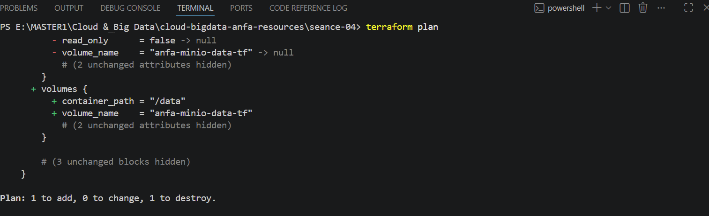
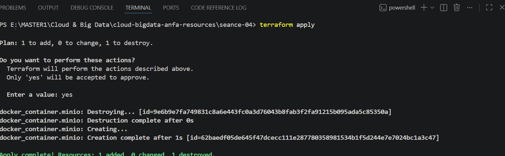
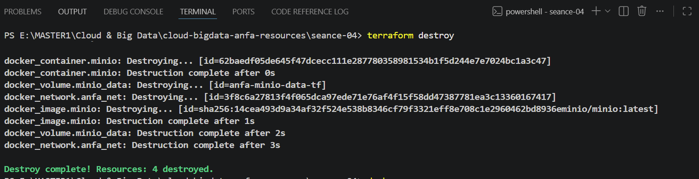

# Rendu — Séance 4
**Nom et prénom :** YEYE Koffi Gagnon  
**Identifiant GitHub :** felixcule  
**Date de soumission :** 27/06/2026  
## Résumé de la séance  

L'Infrastructure as Code (IaC) permet de gérer l'infrastructure comme du code afin de la rendre versionnée, reproductible, testable et facilement maintenable. Terraform, principal outil d'IaC, s'appuie sur des providers, des resources et un fichier state pour créer, gérer et suivre l'état de linfrastructure. Son utilisation suit un workflow simple (init, plan, apply, destroy), où la vérification du plan est une étape essentielle avant tout déploiement. Enfin, Terraform est complémentaire à Ansible, compatible avec OpenTofu, et les connaissances acquises avec Docker sont directement applicables aux principaux fournisseurs cloud comme AWS, GCP, Azure et OVHcloud.

## Étapes principales
1. Installation de Terraform et premier `main.tf` minimal.
2. Maîtrise du workflow `init` → `plan` → `apply` → `destroy`.
3. Compréhension du state Terraform et bonnes pratiques de versioning.
4. Stack complète : réseau, volume, conteneur MinIO.
5. Refactoring en variables et fichier `.tfvars`.
## Captures d'écran

### terraform plan (création initiale)

### terraform apply réussi

### Console MinIO créée par Terraform

### terraform destroy

## Réponses aux exercices d'application

<À compléter d'après les énoncés fournis avec l'assignment.>

## Difficultés rencontrées
Aucune 