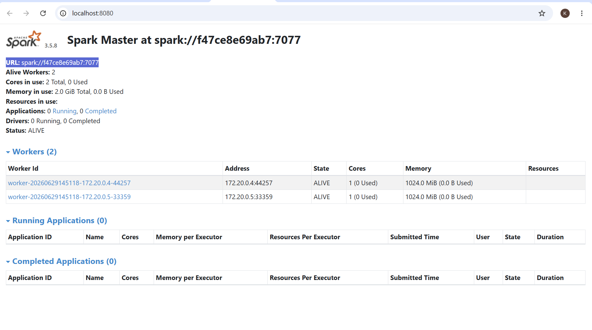
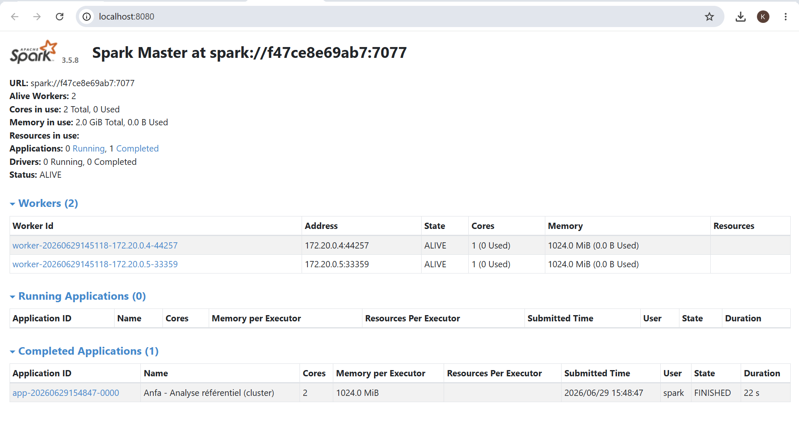
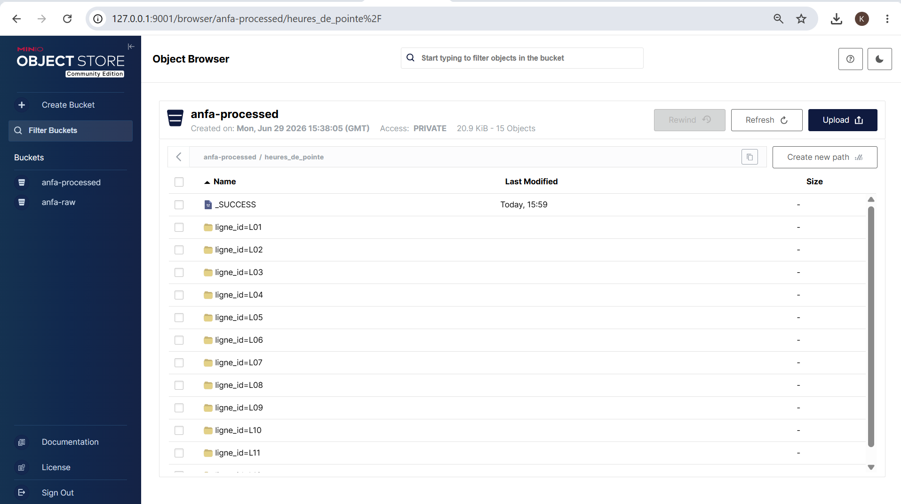
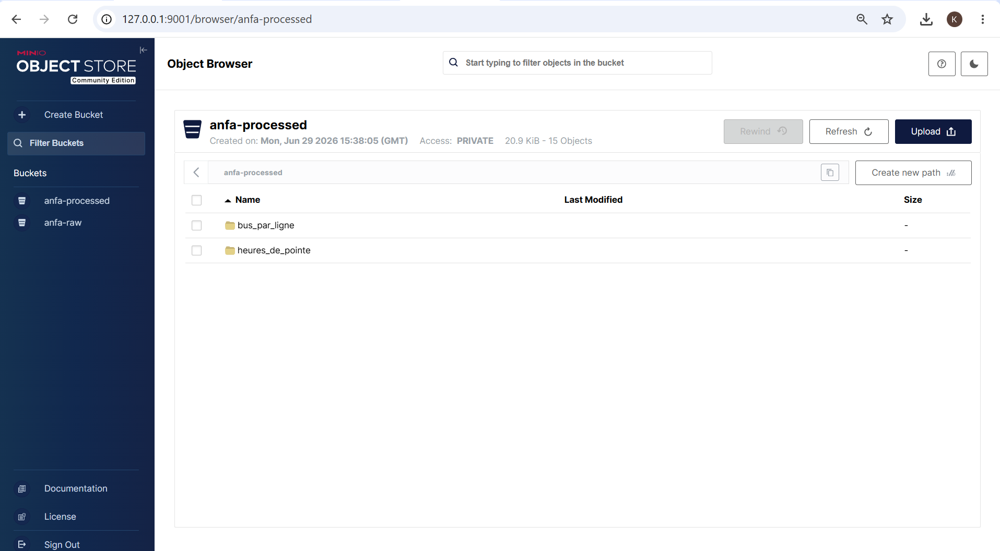

# Rendu Séance 5  
**Nom et prénom :** YEYE Koffi Gagnon  
## Résumé de la séance  
PySpark en mode local est adapté au développement, tandis qu'un cluster Spark est indispensable pour le traitement de gros volumes de données en production, avec un Driver, un Cluster Manager et des Executors qui se répartissent les tâches. Spark peut être déployé en mode Standalone, YARN ou Kubernetes selon les besoins. Les performances dépendent surtout d'un bon partitionnement des données et de la réduction des opérations coûteuses comme le shuffle, notamment lors des groupBy, join et repartition. Enfin, grâce au connecteur S3A, le même code fonctionne avec MinIO et S3, tandis que les solutions managées (Databricks, EMR) privilégient la simplicité et Kubernetes offre davantage de contrôle et de flexibilité.

## Étapes principales  

1. Déploiement du cluster Spark standalone (1 master + 2 workers) via Docker Compose.  
2. Préparation de MinIO et upload du référentiel.  
3. Premier job distribué (`analyse_referentiel_cluster.py`) : statistiques de base.  
4. Génération d'un historique simulé de trajets et job d'analyse des heures de pointe.  
5. Comparaison subjective entre mode local et mode cluster.  

## Captures d'écran  

### Dashboard Spark Master avec 2 workers  

### Application Spark exécutée avec succès  

### Résultats du Top 10 dans la console  

### Bucket anfa-processed avec heures_de_pointe partitionné  

  

## Réflexion : local vs cluster  

 

## Bonus Spark sur Kubernetes  

Non 

## Réponses aux exercices d'application  

## Difficultés rencontrées  
Aucune