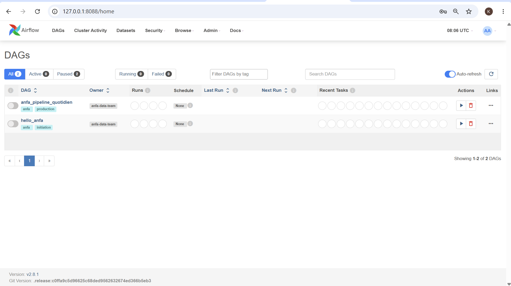
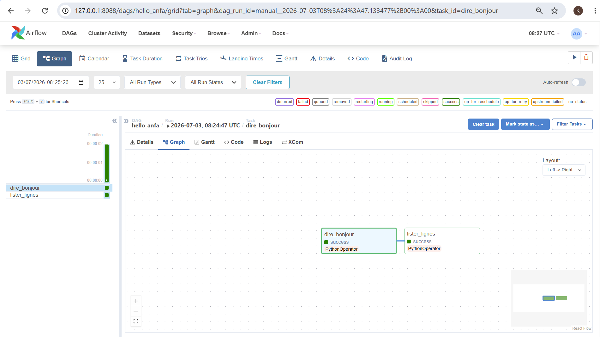
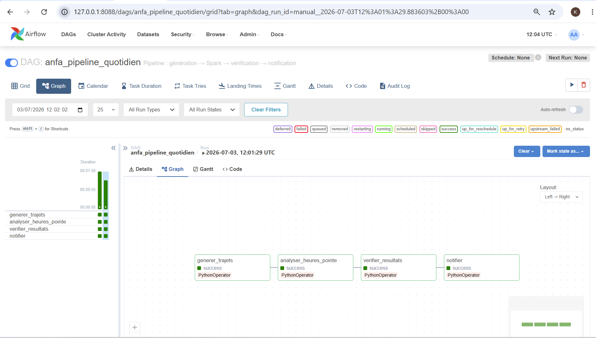
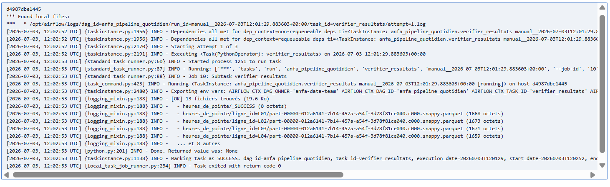
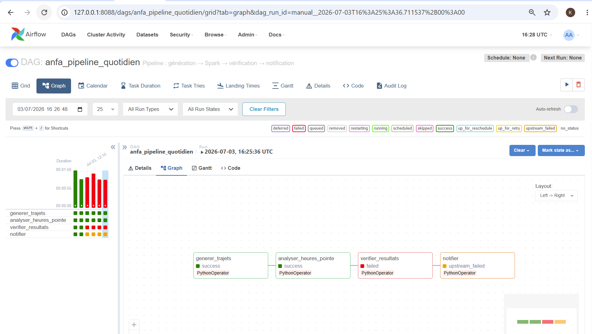

# Rendu : Séance 6

**Nom et prénom :** YEYE Koffi Gagnon    
**Identifiant GitHub :** felixcule    
**Date de soumission :** 03/07/2026  

## Résumé de la séance  

Apache Airflow est un orchestrateur open-source qui permet de définir, planifier et surveiller des pipelines de données en Python, selon la philosophie « Pipelines as Code ». Contrairement à cron, il gère les dépendances entre tâches, les retries automatiques, les alertes, la visualisation graphique et le rejeu de périodes passées (backfill). Son architecture repose sur cinq composants : le Webserver (interface), le Scheduler (planificateur), l'Executor (lanceur de tâches), la Metadata DB (PostgreSQL) et les DAGs (fichiers Python décrivant les workflows). Les trois patterns essentiels à maîtriser sont l'idempotence (rejouer sans effet de bord), le backfill et la gestion native des erreurs, rendant Airflow le standard de facto pour l'orchestration data, déployable partout : local, Kubernetes ou cloud managé (AWS MWAA, GCP Cloud Composer, Astronomer).  

## Étapes principales  

1. Déploiement de la stack (Airflow + PostgreSQL + MinIO + Spark) via Docker Compose.
2. Premier DAG `hello_anfa` à 2 tâches : initiation à la mécanique Airflow.
3. DAG métier `anfa_pipeline_quotidien` à 4 tâches : génération → Spark → vérification → notification.
4. Démonstration des retries et de la gestion d'erreur via un bug volontaire.

## Captures d'écran

### UI Airflow après connexion (vue d'accueil)

### DAG hello_anfa exécuté en succès

### DAG anfa_pipeline_quotidien complet en succès

### Logs de la tâche `verifier_resultats`

### Démonstration du retry : tâche en échec et propagation

## Réflexion personnelle

### Qu'apporte Airflow par rapport à un cron simple ?
Airflow gère les dépendances, retries, alertes, backfill et visualisation graphique alors que cron ignore tout celà.

### Dans quel cas l'utiliser sur un vrai projet ?  
 On peut l'utiliser dès qu'un projet data dépasse une tâche unique : ETL multi-étapes, traitements Spark, ou synchronisation d'événements externes.

## Difficultés rencontrées

Aucune
