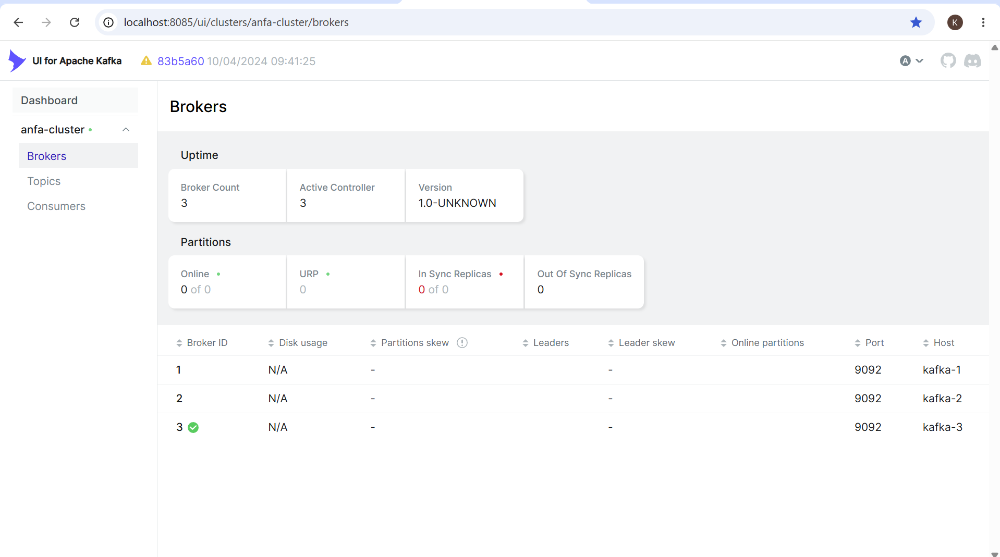
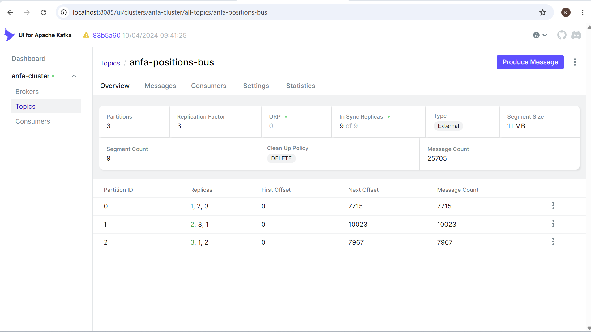
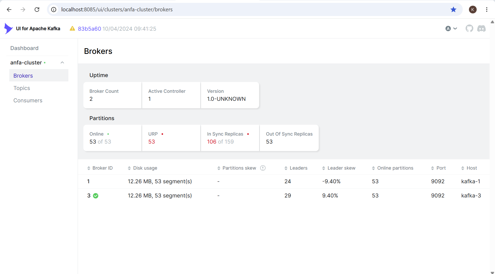
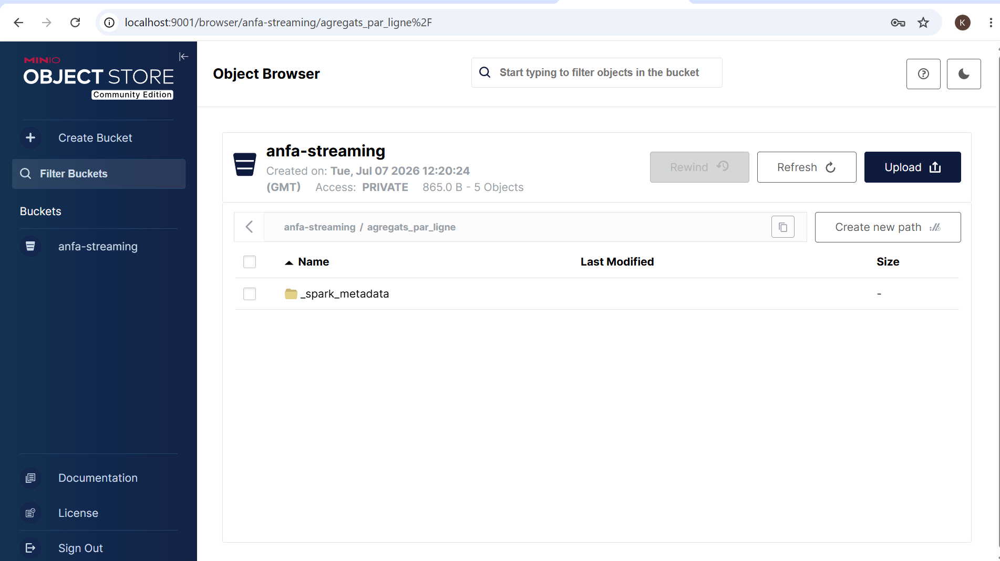

# Rendu — Séance 7

**Nom et prénom :** YEYE Koffi Gagnon   
**Identifiant GitHub :** felixcule   
**Date de soumission :** 07/07/2026   

## Résumé de la séance   

Cette séance 7 marque le passage du traitement par lots (batch) au traitement en flux continu (streaming). Alors que les séances précédentes utilisaient Spark et Airflow pour traiter des fichiers complets une fois par jour, on aborde maintenant les architectures pilotées par les événements, où les données sont traitées dès leur arrivée. Apache Kafka est présenté comme un journal distribué qui stocke les événements dans des topics découpés en partitions, répartis sur un cluster de brokers pour assurer scalabilité et tolérance aux pannes. Le cœur du système réside dans le découplage entre producteurs et consommateurs : un émetteur publie dans un topic sans connaître ses lecteurs, et plusieurs groupes de consommateurs peuvent lire le même flux indépendamment, chacun gérant ses propres offsets pour ne jamais perdre de message ni pouvoir rejouer l'historique. Enfin, Spark Structured Streaming permet de consommer ces flux Kafka avec la même API DataFrame que le batch, en découpant le flux en micro-lots et en calculant des agrégats par fenêtres temporelles pour des analyses en temps quasi réel.   

## Étapes principales  

1. Déploiement du cluster Kafka (3 brokers, mode KRaft) + Kafka UI.
2. Création du topic `anfa-positions-bus` (3 partitions, réplication 3).
3. Premier producer/consumer Python pour comprendre la mécanique.
4. Simulation de 100 bus envoyant leur position en continu.
5. Démonstration de tolérance aux pannes (arrêt d'un broker).
6. Spark Structured Streaming : lecture console, puis agrégation en fenêtre vers MinIO.  

## Captures d'écran  

### 3 brokers actifs dans Kafka UI

### Débit de messages en augmentation

### Cluster avec 2 brokers sur 3 (après arrêt volontaire)

### Micro-batchs affichés en console par Spark

### Résultats agrégés dans MinIO

## Réflexion personnelle

### Dans quel cas utiliser Kafka + Spark Streaming plutôt que Airflow + Spark batch ? 
Kafka + Spark Streaming est utilisé lorsque les données arrivent en continu et doivent être traitées en temps réel avec une faible latence. Airflow + Spark batch convient plutôt aux traitements planifiés sur des données collectées pendant une période donnée. 

### Qu'est-ce que la réplication à 3 brokers vous a concrètement montré ? 
La réplication à 3 brokers montre que les données Kafka sont copiées sur plusieurs serveurs pour assurer la disponibilité. Même si un broker tombe en panne, les messages restent accessibles sans perte de données. 

## Réponses aux exercices d'application

## Difficultés rencontrées

Aucune
