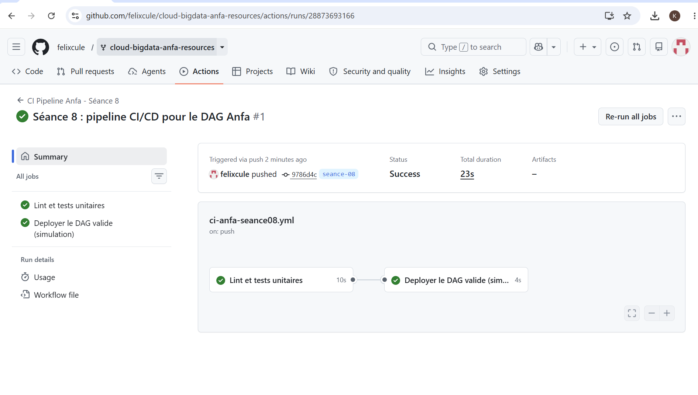
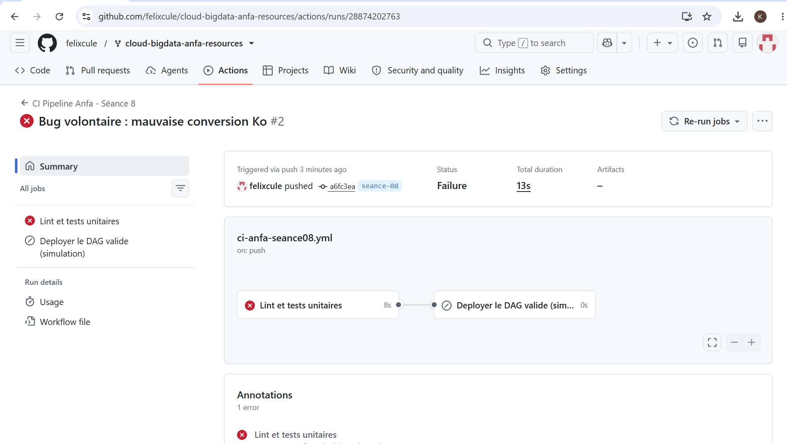

# Rendu — Séance 8  

**Nom et prénom :** YEYE Koffi Gagnon   
**Identifiant GitHub :** felixcule  
**Date de soumission :** 07/07/2026  

## Résumé de la séance  

Le DataOps applique les principes DevOps aux pipelines de données pour automatiser tests et déploiements, évitant les erreurs de déploiement manuel. Trois types de tests sont essentiels : unitaires (code), données (qualité) et contrats (interfaces entre équipes). Un pipeline CI/CD enchaîne lint, tests, build, publish et déploiement, chaque étape bloquant la suivante en cas d'échec. GitHub Actions orchestre ces workflows en YAML, tandis que le GitOps fait de Git la source unique de vérité via des Pull Request revues avant tout merge. 

## Étapes principales  

1. Séparation de la logique métier (`anfa_logic.py`) du DAG Airflow.
2. Écriture de 5 tests unitaires avec pytest.
3. Écriture du workflow GitHub Actions (lint + tests + déploiement simulé).
4. Démonstration : un bug volontaire bloque le déploiement ; correction et succès.

## Captures d'écran

### Workflow réussi (2 jobs)

### Job en échec, déploiement non exécuté

## Réflexion personnelle

### En quoi ce pipeline aurait-il empêché l'incident de Mawuli (situation-problème du CM) ?  
Le pipeline aurait bloqué Mawuli dès l'étape Lint (erreur de syntaxe) ou Tests (variable d'environnement manquante), et la revue par Pull Request aurait empêché le merge sans validation d'un collègue. Son code bogué n'aurait jamais atteint la production.  

### Qu'est-ce que `needs:` change concrètement ?  
Needs crée une dépendance entre jobs : un job ne démarre que si le précédent a réussi. Par exemple, l'image Docker n'est pas construite si les tests échouent, évitant ainsi de publier du code défectueux.  

## Difficultés rencontrées

Aucune
