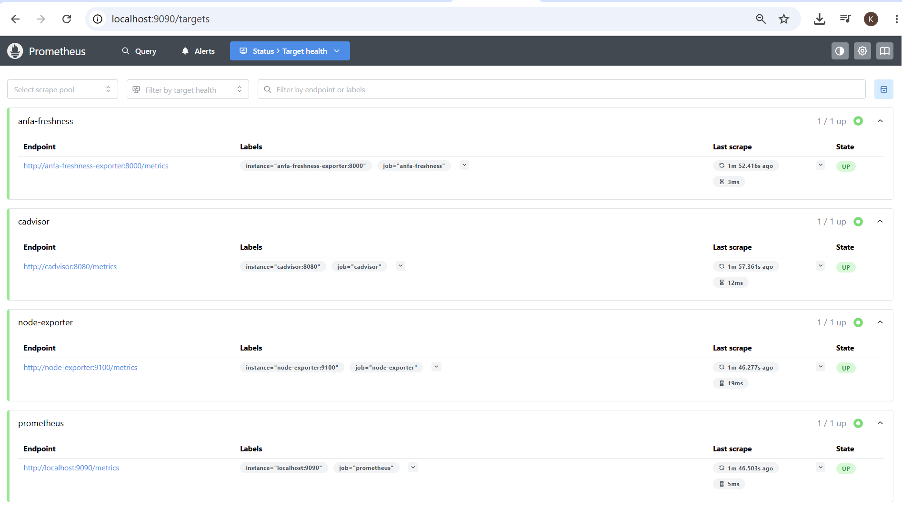
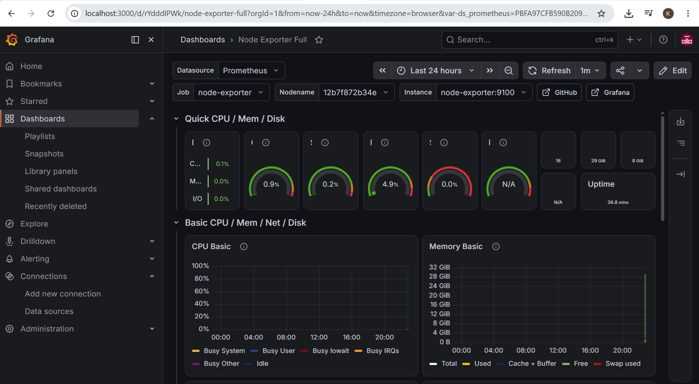
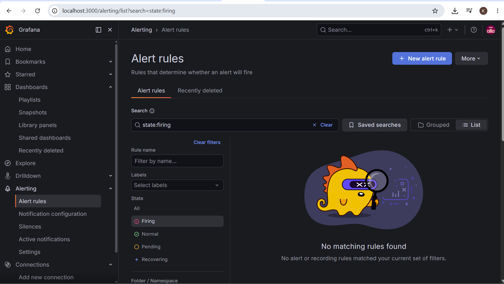

# Rendu — Séance 9

**Nom et prénom :** YEYE Koffi Gagnon  
**Identifiant GitHub :** felixcule  
**Date de soumission :** 08/07/2026  

## Résumé de la séance  

La séance 9 déploie la stack Prometheus/Grafana pour surveiller la plateforme Anfa, en instrumentant un exportateur de fraîcheur qui publie l'horodatage du dernier traitement réussi du pipeline. Un dashboard Grafana est construit pour visualiser en temps réel les métriques critiques, notamment la fraîcheur des données qui a piégé Awa dans la situation problème. Une alerte est configurée sur un seuil de latence dépassé, puis déclenchée sur une panne simulée pour valider le mécanisme de notification. Cette démarche complète, du déploiement à l'alerte testée, transforme l'observabilité d'Anfa d'un simple "ça tourne" à une véritable capacité de détection proactive des dégradations silencieuses.  

## Étapes principales

1. Déploiement de Prometheus, Node Exporter, cAdvisor, Grafana et d'un exportateur
   métier custom (fraîcheur des données Anfa).
2. Exploration des cibles Prometheus et premières requêtes PromQL.
3. Import du dashboard "Node Exporter Full" et construction d'un panneau custom.
4. Configuration d'une alerte Grafana sur la fraîcheur des données.
5. Simulation d'une panne silencieuse et observation du déclenchement de l'alerte.

## Captures d'écran

### Les 4 cibles Prometheus à l'état UP

### Dashboard "Node Exporter Full" importé

### Alerte à l'état Firing après panne simulée

## Réflexion personnelle

### En quoi cette séance répond-elle directement à la situation-problème d'Awa dans le CM ? 

Elle passe de "ça tourne ?" à "ça produit de la valeur ?", via l'observabilité et les alertes SLI/SLO. Ainsi on détecte des données vides alors que pods et DAGs affichent la normalité.

### Qu'est-ce que la métrique de fraîcheur vous a permis de voir que les autres métriques (CPU, RAM, statut des conteneurs) ne montraient pas ?

Parce que le pipeline était vivant mais inutile : le CPU et les statuts étaient normaux, mais l'horodatage du dernier fichier ne bougeait plus, exposant le traitement de données vides sans erreur technique.

## Difficultés rencontrées

Aucune 
