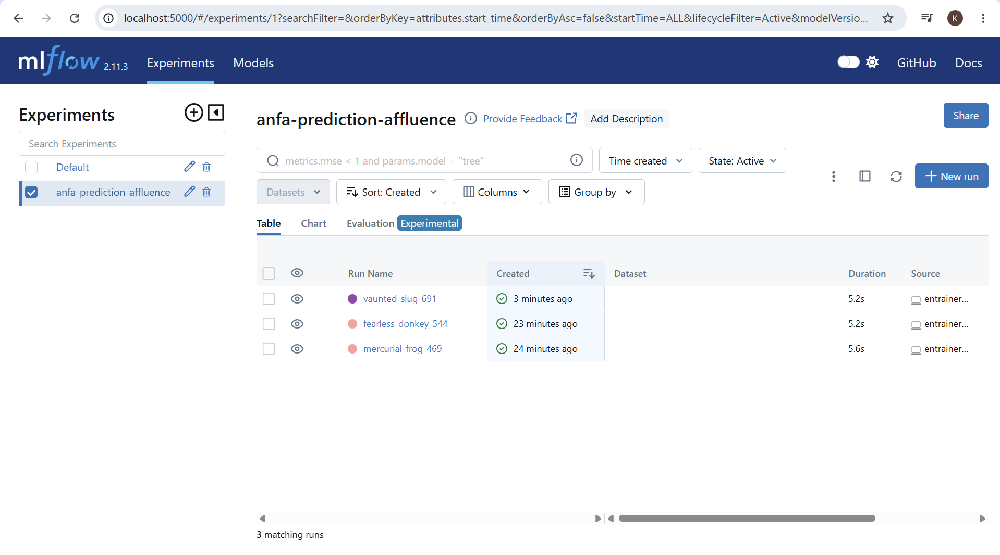
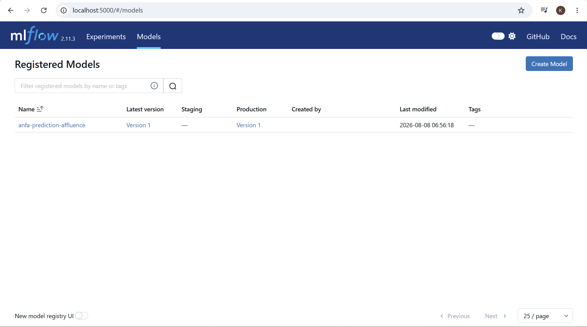

# Rendu — Séance 10

**Nom et prénom :** <YEYE Koffi Gagnon>
**Identifiant GitHub :** <felixcule>
**Date de soumission :** <08/08/2026>

## Résumé de la séance

La séance 10 a permis de déployer un serveur MLflow Tracking via Docker, puis d'entraîner et tracer trois versions d'un modèle de prédiction d'affluence avec des hyperparamètres différents. Ces expérimentations ont été comparées dans l'interface MLflow afin d'identifier le meilleur run (vaunted-slug-691) au regard du R², puis ce modèle a été enregistré dans le Model Registry sous le nom « anfa-prediction-affluence » et promu au statut Production. En parallèle, le cours magistral a couvert le cycle de vie MLOps, la dérive de données (data drift) et la gouvernance des données, ce qui a été mis en pratique par la rédaction d'une fiche de conformité non technique pour un jeu de données sensible de l'application mobile Anfa, en s'appuyant sur la loi togolaise et les principes de souveraineté des données.

## Étapes principales

1. Déploiement d'un serveur MLflow Tracking (SQLite + stockage local).
2. Génération d'un jeu de données d'affluence Anfa et entraînement de 3 variantes
   d'un modèle RandomForest, chacune tracée avec MLflow.
3. Comparaison des runs dans l'UI et identification du meilleur candidat.
4. Enregistrement du modèle dans le Model Registry, transition en statut Production.
5. Rédaction d'une fiche de conformité pour un scénario d'application mobile Anfa.

## Captures d'écran

### Tableau des 3 runs comparés

### Modèle enregistré en statut Production

## Réflexion personnelle

Le problème de Kossi, décrit dans le CM séance 10, est que son modèle de prédiction d'affluence tournait en production depuis trois mois sans que personne ne sache exactement quelle version était déployée ni avec quels paramètres, ce qui a empêché de détecter sa dégradation silencieuse face aux deux nouvelles lignes. Le Model Registry résout ce problème en constituant un catalogue centralisé où chaque version porte un statut explicite (Staging, Production, Archived), permettant ainsi de savoir avec certitude quelle version tourne réellement à tout moment. Il offre également la capacité de revenir en arrière (rollback) vers une version antérieure si une dérive est constatée, éliminant ainsi le chaos des notebooks dispersés nommés test_v2_final.ipynb évoqué dans le CM.
Le lien entre versionner un modèle et versionner une infrastructure avec Terraform réside dans le fait qu'il s'agit du même principe de traçabilité et de source de vérité unique appliqué à deux objets différents. Le CM séance 10 le formalise explicitement : le Model Registry trace quelle version de modèle est en production, par qui et quand, tandis que le state Terraform (séance 4) trace l'état réel de l'infrastructure et constitue sa mémoire. Dans les deux cas, on ne fait pas confiance à la mémoire humaine : on dispose d'une trace formelle, versionnée et horodatée qui permet de recréer un état antérieur, que ce soit pour restaurer une infrastructure ou pour basculer un modèle vers une version Archived.

## Difficultés rencontrées

Aucune
